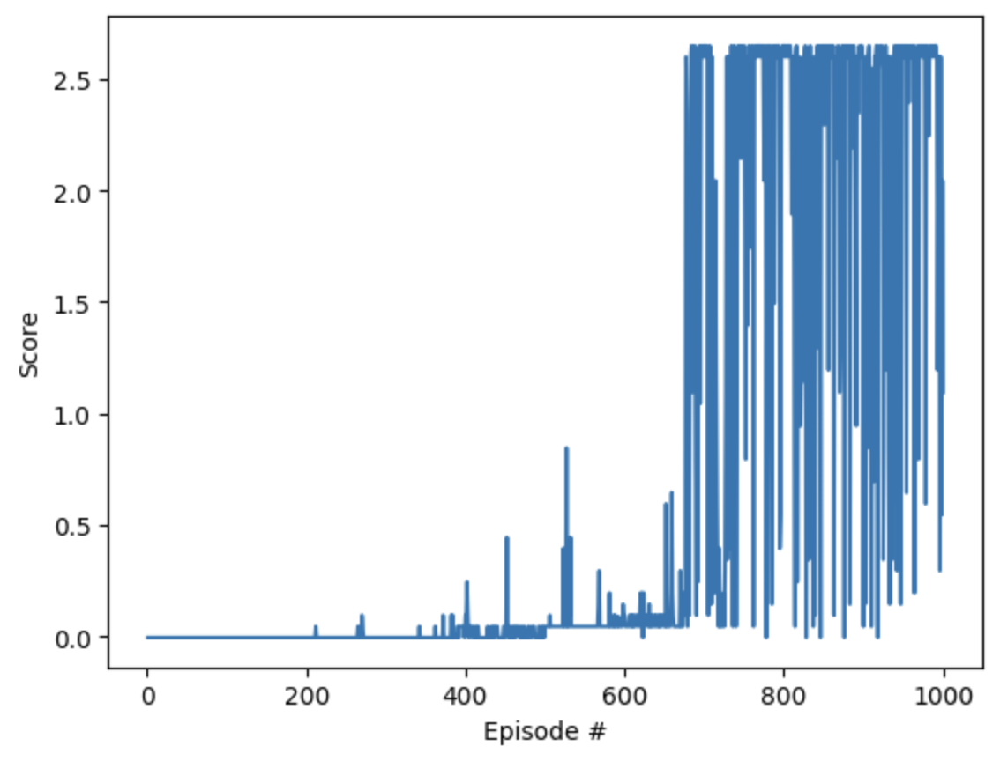

# What is this document?

This document details the code used to train the agent along with the results got with the training method and the agent used. At the end a section shows what are potential future works to improve the agent.

# The Agent
This repo uses a variant of the DDPG for multi-agents training. The code is very similar to DDPG but uses a shared memory between the agents for a better learning. Each agents is based on the DDPG (Deep Deterministic Policy Gradient) agent code provided in the previous course. It is defined in the [ddpg_agent.py](ddpg_agent.py) file.

The agent uses a similar approach to the DDPG created by Google Deepmind ([CONTINUOUS CONTROL WITH DEEP REINFORCEMENT
LEARNING](https://arxiv.org/pdf/1509.02971)). DDPG is similar to DQN, and is a special kind of Actor-Critic approach where the critic is used to approximate the maximizer over the Q values of the next states.

The agent also uses two improvements over the original DDPG (more info here: https://spinningup.openai.com/en/latest/algorithms/ddpg.html):
- Target Networks to help the neural networks converge as the Q-table evolves during the training. DDPG is based off DQN and hence can benefit from the same improvements. DDPG introduced the Soft update approach over the original weight copy used by DQN to sync the two networks (see page 4 of [CONTINUOUS CONTROL WITH DEEP REINFORCEMENT LEARNING](https://arxiv.org/pdf/1509.02971)). 
In practice the code uses 4 Q-networks (actor_local, actor_target, critic_local and critic_target). Only the "Local" networks are trained using an Adam optimizer and a classic backprogration method. The "Target" weights are updated from the Q-Local network weights but with a interpolation between the new weights (from Q-Local) and the old weight (Q-Target) so that so values are following slowly the new values (if the interpolation parameters called Tau is small enough, here 1e-3)
- Experience Replay to randomize the experience used for learning in order to prevent the network to learn the relation between previous choices and subsequent choices.

## The models
There are two models, one for the Actor and one for the Critic.
Specifically they uses Pytorch Machine Learning Models defined in [ddpg_model.py](ddpg_model.py). 

The actor model is a Multi Layer Perceptron (MLP) using 3 layers:
- One input layer with the size of the state as entry (here 24) and an arbitrary size as output (here 256)
- One hidden layer with the an input size the same as the output from the previous layer and an arbitrary output size (here 256) 
- One final layer with the an input size the same as the output from the previous layer and an output size equals to the number of action.
- The model also use a batch normalization.

The model uses two ReLU (Rectified Linear Unit) as activation function between the layers. The last layer uses a TANH activation function. 

The input layer and output layer are constrained by the environment info (State size for input, action size for output), the internal layer is the only one that can vary, we have update it to 256 as keeping the default value of 128 did not give good results.

The critic model is similar to the actor however the second layer includes also the action values as input and hence has a larger number of units. The output is also different as it only output one value and does not use an activation function.

## The Learning Algorithm
The learning algorithm is defined in the [ddpg_agent.py](ddpg_agent.py) through the following methods:

- step: allow the network to "memorize" (add in experience replay buffer) the current step and if enougth samples are available in memory learn from these past experiences at random. Note that in this variant the memory is shared among agents.
- act: get the next action. Instead of using an epsilong-greedy approach (as in DQN), it adds some random noise to the action probabilities to allows for exploration. The noise is generated using a Ornstein-Uhlenbeck process.
- learn: this method is called by the step method and used to train the Actor and Critic from the past experiences. 
    - It uses the actor_target network model to predict the next actions from all the states, then use the critic_target to compute the targets for the next states given the next actions.
    - It then computes the current targets and the expected ones
    - Then loss is calculated by comparing the expected targets (from the Critic) to the current target (from the actor)
    - Backpropagation is used to update the weight of both local networks (actor and critic) and Soft update is used to slowly sync the target networks and local ones.

Note that the step method uses "memories" stored in a ReplayBuffer that is also defined in this file. The ReplayBuffer is a structure used to store the S,A,R,S' values for each experience and to randomly sample those experiences when needed for learning.

Unlike the regular DDPG, here two agents are trained at the same time, however because they use the same agent model and the same environment, we need to split the actions for each agents (the model returns the actions for all agents at the same time but we only need one or the other). See the mmddpg function in the Tennis.ipynb file for more details.

# The hyperparameters
Along with the changes to the number of units in the hidden layer of the models (and the critic architecture), we have also adjusted the hyper-parameters from the course code as follow:

BUFFER_SIZE = int(1e6)  - Same as in the course
BATCH_SIZE = 256        - Changed from 128 to 256

GAMMA = 0.99            - Same as in the course
TAU = 0.005             - Changed from 1e-3 to 0.005
LR_ACTOR = 3e-4         - Changed from 1e-4 to 3e-4
LR_CRITIC = 3e-4        - Same as in the course
WEIGHT_DECAY = 0        - Changed from 0.0001 to 0

Note that unlike previous implementation, because the memories are shared among the agents, the BUFFER_SIZE and BATCH_SIZE are defined in the Tennis.ipynb file while the other parameters are defined in the ddpg_agent.py.

Most of these values where tested one after the others to see how it impacted the training, the values were borrowed from this code from OpenAI: ([TD3](https://github.com/sfujim/TD3))

One major impact was to remove the maximum numbers of steps to train the agent, in the new implementation the agent train until it is able to get done from the environment (no limit of steps). However as the agents gets better, each episode last longer so the training is therefore longer at the end of the episodes.

# The results

As shown in the plots below, the algorithm was able to learn how to play the Reacher game in about 700 episodes with an average score of 0.5 over the 100 last attempts. 

For the sake of learning more, we kept the algorithm continue running until the 1000th iteration to see how much it could reach. The average score was then 2.08.

Also here is a video of the game as played by the agent after being trained for 1000 episodes 

<video width="1282" height="756" controls>
  <source src="P3_Tennis.mp4" type="video/mp4">
</video>

# Ideas for future work

This section lists some of the ideas to improve the algorithm:
- We can see that there is a lot of "noise" movements, that is the racket move withouh much reason as the ball is on the other side of the game. We could re-train the agents adding negative rewards for each movement to force the agents to stay more steady.
- As mentioned in this report, we have removed the number of maximum steps to train the agents. While this helps in the early stage of the training it makes the training longer at the end as the "players" get better and don't let the ball fall (as visible in the video). So one way to speed-up the traning would be to stop the episode when reaching a certain score or re-introducing a number of max steps if the episodes takes too long.
- We could try the TD3 algorithm from OpenAI to see if it would train faster